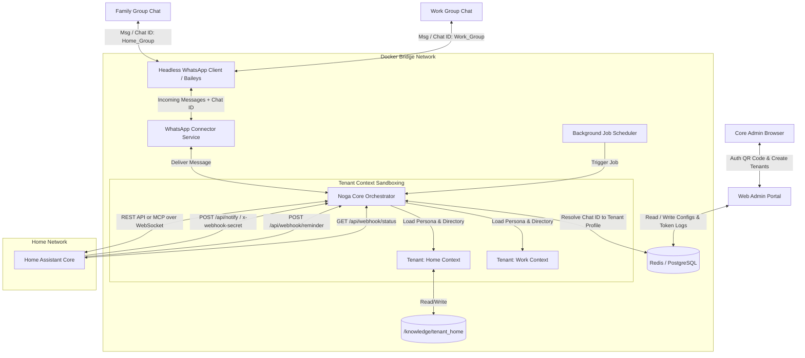

# Noga WhatsApp AI Assistant - System Design & Architecture

## 1. Overview & Objectives
This project details the architecture for **Noga**, a modular, Dockerized Home Assistant interface accessible via WhatsApp. It is powered by the **Google Gemini API (Google AI Studio)** and features dynamic model switching, bilingual support (Hebrew & English), and integration with home automation hubs (like Home Assistant Core).

Noga functions as an **Autonomous AI Agent** (inspired by Hermes and OpenClaw) that manages calendars, reads and writes its own Markdown-based knowledge base and skills repositories, and integrates with **Google Calendar** using a Google Service Account.

Additionally, Noga exposes a webhook gateway on port `3000` that handles proactive events (notifications, image uploads, and reminders) dispatched by Home Assistant automations, and exposes a connection status API back to Home Assistant.

To keep the deployment stack simple and consolidated, **Home Assistant communication is handled directly inside the core Orchestrator**. The orchestrator includes built-in clients to interact with HASS either via its standard REST API or by initiating direct Model Context Protocol (MCP) client connections, eliminating the need for separate connector images in the Docker stack.

---

## 2. High-Level Architecture

The system consists of the admin portal, the WhatsApp Baileys gateway, and the core orchestrator. All external communication (Gemini, Google, and Home Assistant) goes directly through the orchestrator.



---

## 3. Modular Service Breakdown

### 3.1 WhatsApp Connector Container (`whatsapp-connector`)
* **Role:** Establishes the single core WhatsApp Web connection using Baileys.

### 3.2 Web Admin Portal / Gateway Container (`admin-portal`)
* **Role:** Centralized configuration panel and entry API endpoint. Mapped to external host port `3000`.

### 3.3 Noga Core Orchestrator Container (`ai-orchestrator`)
* **Role:** The **Autonomous Agent Engine**, Webhook Server, and Home Assistant Driver.
* **Responsibilities:**
  * **Tenant Context Router:** Scopes variables and tool lists per tenant chat.
  * **Proactive Webhook API Router:** Exposes endpoints to receive HASS messages and status queries.
  * **Integrated Home Assistant Drivers:** 
    * *Direct REST Client:* Built-in HTTP client calls HASS endpoints (e.g. `/api/services/...`) directly using HASS long-lived tokens configured in settings.
    * *Direct MCP Client:* Spawns a websocket client connection to connect directly to the Home Assistant instance, fetching dynamic tool declarations.
  * **Token Logger Middleware:** Records usage metadata from Gemini.
  * **Background Job & Scheduler Daemon:** Manages dynamic cron execution.

---

## 4. Multi-Tenant Identity & Scope Isolation

### 4.1 Tenant Context Resolution Lifecycle
Messages resolve by `chat_id` to load configurations, schemas, and restrict active tool execution.

### 4.2 Database Schemas (Multi-Tenant Updates)

#### Tenant Profile Schema (`tenants` table)
```json
{
  "tenant_id": "string (Primary Key)",
  "name": "string (e.g., 'Levi Home')",
  "enabled": "boolean",
  "reply_method": "ALL_MESSAGES | TAGGED | KEYWORD",
  "trigger_keywords": ["string"],
  "system_prompt": "text",
  "active_model": "string",
  "language": "string (he | en)",
  "enabled_tools": ["string"],
  "webhook_secret": "string",
  "hass_url": "string (Tenant-specific HASS base URL)",
  "hass_token": "string (Tenant-specific HASS long-lived token)"
}
```

---

## 5. Dynamic Agentic Cronjobs Execution Lifecycle
The cron scheduler initiates background runs of the agent.

---

## 6. Proactive Webhook Gateway (Home Assistant Integration Specs)
Noga exposes REST endpoints on port `3000` to allow Home Assistant to broadcast notifications, schedule reminders, and query WhatsApp connection status.

---

## 7. Modular Core Skills Catalog
Core skills are modular folders, mapped dynamically depending on `enabled_tools` in the tenant configuration. File reads/writes are strictly sandbox-confined.

### 7.1 Reminders & Cronjobs
* **Dynamic Cron Execution:** Rather than static triggers, the scheduler loads the `instruction_prompt` and pipes it into the ReAct engine to assemble the payload dynamically.
* **Tools:**
  * `schedule_job(cron_expression, name, instruction_prompt)`
  * `cancel_job(job_id)`
  * `list_jobs()`

### 7.2 Shopping List
Confined to `/knowledge/{tenant_id}/shopping_list.md`.

### 7.3 Web Browsing & Information Retrieval
General tool, enabled/disabled per tenant profile.

### 7.4 Home Assistant Automation
* **Execution:** Handled directly within the `ai-orchestrator` process (no helper container).
* **REST Driver:** Orchestrator queries HASS entities and dispatches actions using HTTP requests.
* **MCP Driver:** Orchestrator initiates an MCP-over-WebSocket protocol to query available tools from HASS.

---

## 8. Google Calendar Service Account Integration
Handles shared family calendar events. Calendars are mapped per tenant.

---

## 9. WhatsApp Group Interaction & Family Whitelisting
Handles message filtering, trigger words, and context formatting for tenant-specific groups.

---

## 10. Autonomous Agent Loop & Self-Learning Lifecycle
Agent executes step-by-step logic, confined to the active tenant directory scope.

---

## 11. Baileys Integration & Authentication Lifecycle
Authenticates via headless WhatsApp web and persists session details to `whatsapp_session` volume.

---

## 12. Gemini API & Model Settings
Cost metrics and settings matrix controls.

---

## 13. Docker Compose Configuration Sketch

Below is the conceptual layout of the multi-container stack. The separate HASS connector services have been removed, consolidating the HASS interface logic inside `ai-orchestrator`:

```yaml
version: '3.8'

services:
  admin-portal:
    build: ./admin-portal
    ports:
      - "3000:3000"  # Exposes the webhook endpoints and status dashboard to Host / HASS
    environment:
      - CORE_ORCHESTRATOR_URL=http://ai-orchestrator:5000
      - CONNECTOR_STATUS_URL=http://whatsapp-connector:8080
    volumes:
      - agent_knowledge:/app/knowledge:rw
      - agent_skills:/app/skills:rw
      - google_credentials:/app/credentials:rw
    depends_on:
      - ai-orchestrator

  whatsapp-connector:
    build: ./whatsapp-connector
    ports:
      - "8080:8080"
    environment:
      - CORE_ORCHESTRATOR_URL=http://ai-orchestrator:5000
    volumes:
      - whatsapp_session:/app/auth_info_multi_folder
    depends_on:
      - redis

  ai-orchestrator:
    build: ./ai-orchestrator
    environment:
      - GEMINI_API_KEY=${GEMINI_API_KEY}
      - GOOGLE_APPLICATION_CREDENTIALS=/app/credentials/service-account.json
      - REDIS_URL=redis://redis:6379/0
      - DB_URL=postgresql://user:pass@db:5432/db
    volumes:
      - agent_knowledge:/app/knowledge
      - agent_skills:/app/skills
      - google_credentials:/app/credentials:ro
    depends_on:
      - redis
      - db

  redis:
    image: redis:7-alpine
    ports:
      - "6379:6379"

  db:
    image: postgres:15-alpine
    environment:
      - POSTGRES_USER=user
      - POSTGRES_PASSWORD=pass
      - POSTGRES_DB=db
    volumes:
      - pgdata:/var/lib/postgresql/data

volumes:
  pgdata:
  whatsapp_session:
  agent_knowledge:
  agent_skills:
  google_credentials:
```

---

## 14. Next Steps & Refining Design
1. [ ] Define structural YAML headers for custom-compiled skills inside the `/skills` directory.
2. [ ] Detail standard operating procedure for the ReAct loop step limits to prevent run-away Gemini token usage.
3. [ ] Choose a sandboxing model for executing dynamically created skills.
